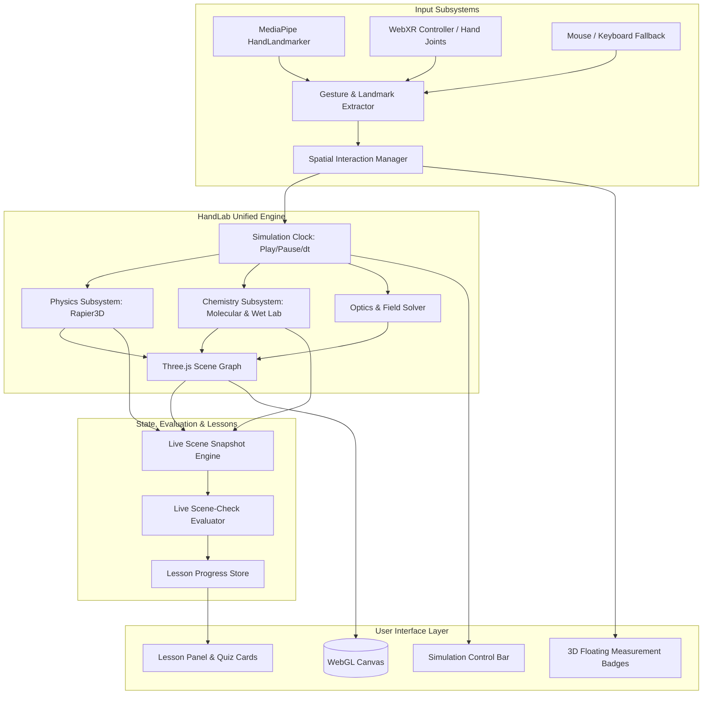
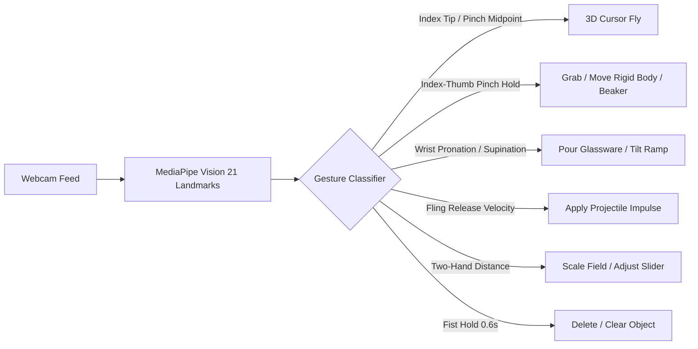

# HandLab 3D Science: Comprehensive Engineering Blueprint & Implementation Plan

This document serves as the master technical specification for transforming [`handlab`](file:///Users/aaronsinesh/handlab) from a geometric 3D shape sandbox into a premier, interactive **3D Virtual Science Laboratory** for **Physics** and **Chemistry** experiments and lessons.

---

## 1. Master System Architecture & Data Flow

### 1.1 Architecture Diagram



### 1.2 Coordinate System Alignment
1. **MediaPipe Tracking Space**: Normalized viewport coordinates $[0, 1] \times [0, 1]$ with relative depth $Z$.
2. **Three.js World Space**: Right-handed Cartesian coordinates $(X, Y, Z)$ centered at $(0, 0, 0)$ with table surface at $Y = -2.6$.
3. **Rapier3D Simulation Space**: 1:1 isometric mapping with Three.js world units ($1\text{ unit} = 1\text{ meter}$).
4. **Transform Pipeline**:
   $$\mathbf{P}_{\text{world}} = \text{Unproject}\left(\mathbf{P}_{\text{screen}}, \mathbf{D}_{\text{fused}}\right)$$
   Rigid bodies in Rapier update Three.js meshes each frame:
   $$\mathbf{M}_{\text{mesh}} = \mathbf{T}(\mathbf{P}_{\text{rapier}}) \cdot \mathbf{R}(\mathbf{Q}_{\text{rapier}})$$

### 1.3 Simulation Clock & Determinism
- **Fixed Timestep Accumulator**: Physics and chemical kinetics run on a fixed $\Delta t = 1/60\text{ s}$ ($16.67\text{ ms}$), decoupled from variable display render frame rates.
- **Time Dilation**: Supports $1.0\times$ (normal), $0.25\times$ (slow motion for high-speed projectile/collision analysis), $0.0\times$ (paused), and $+1\text{ step}$ ($16.67\text{ ms}$ forward impulse).
- **Snapshot & Restore**: Complete world state serialization allowing instant `Reset` to the start of an experiment.

---

## 2. Physics Engine Specification (`lib/physics/`)

### 2.1 Dependencies & Initialization
- **Library**: `@dimforge/rapier3d-compat` (WebAssembly build, compatible with Next.js client-side execution).
- **World Config**:
  - Gravity vector: $\vec{g} = (0, -9.81, 0)\text{ m/s}^2$ (dynamically modifiable to simulate Moon $1.62\text{ m/s}^2$ or Zero-G).
  - Integration parameters: `predictionDistance = 0.002`, `maxVelocityIterations = 4`, `maxPositionIterations = 1`.
  - Continuous Collision Detection (CCD) enabled on all high-speed projectiles.

### 2.2 Mechanics Sandbox Modules (`lib/physics/mechanics/`)
1. **Rigid Body Factory (`lib/physics/bodies.ts`)**:
   - `createDynamicSphere(radius, mass, restitution, friction)`
   - `createDynamicBox(halfExtents, mass, restitution, friction)`
   - `createStaticPlane(normal, distance, friction)`
   - `createCompoundCart(chassisSize, wheelRadius, mass)`

2. **Inclined Plane & Friction Experiment**:
   - Ramp mesh with adjustable tilt angle $\theta \in [0^\circ, 85^\circ]$.
   - Visual readout of forces:
     - Parallel force: $F_\parallel = mg \sin\theta$
     - Normal force: $F_\perp = mg \cos\theta$
     - Maximum static friction: $f_{s,\max} = \mu_s F_\perp$
     - Kinetic friction: $f_k = \mu_k F_\perp$
   - Real-time detection of static-to-kinetic transition angle $\theta_c = \arctan(\mu_s)$.

3. **Projectile Motion & Target Launcher**:
   - Cannon barrel with 2DoF orientation: elevation angle $\theta$, azimuth $\phi$, and muzzle speed $v_0$.
   - **Analytic Parabolic Guide Line**:
     $$\vec{r}(t) = \vec{r}_0 + \vec{v}_0 t + \frac{1}{2}\vec{g}t^2$$
   - **Simulated Trajectory**: Real-time integration including quadratic aerodynamic drag:
     $$\vec{F}_{\text{drag}} = -\frac{1}{2} \rho C_d A \|\vec{v}\|\vec{v}$$
   - Target basket with collision sensor trigger for lesson objective evaluation.

4. **Harmonic Motion & Springs (`lib/physics/springs.ts`)**:
   - Hooke's Law spring constraint connecting an anchor point to a dynamic mass:
     $$\vec{F}_{\text{spring}} = -k (\|\vec{x} - \vec{x}_0\| - L_0) \hat{u} - c (\vec{v} \cdot \hat{u}) \hat{u}$$
   - Parametric spring coil geometry generated in Three.js (helical spline updating dynamically with spring displacement).
   - Pendulum constraint using Rapier spherical joint with frictionless damping.

5. **Collision & Momentum Track**:
   - Low-friction linear rail with two colliding gliders.
   - Elasticity bumper setting: $e = 1.0$ (perfectly elastic), $0.5$ (partially inelastic), $0.0$ (perfectly inelastic sticking).
   - Floating vector arrows showing instantaneous linear momentum $\vec{p} = m\vec{v}$ and kinetic energy bar $K = \frac{1}{2}mv^2$.

### 2.3 Electrostatics & Electromagnetism (`lib/physics/electrostatics.ts`)
- **Point Charge Representation**:
  - Sphere meshes with $+q$ (red glow) and $-q$ (blue glow), draggable in 3D.
- **Field Vector Field Grid**:
  - Instanced Three.js cone/cylinder arrows arranged on an interactive 3D spatial grid.
  - Electric field calculation at point $\vec{r}$:
    $$\vec{E}(\vec{r}) = \frac{1}{4\pi\varepsilon_0}\sum_{i=1}^N \frac{q_i}{\|\vec{r} - \vec{r}_i\|^3} (\vec{r} - \vec{r}_i)$$
  - Vector arrow rotation aligns with $\vec{E}$; length and opacity scaled logarithmically to represent field intensity $\|\vec{E}\|$.
- **Charged Particle Tracer**:
  - Test electron ($q = -1$) and proton ($q = +1$) launched into the field; trajectory integrated via 4th-order Runge-Kutta (RK4).

### 2.4 Ray Optics & Wave Physics (`lib/physics/optics.ts`)
- **Laser Emitter**:
  - Emits directional light rays modeled as 3D line segments with recursive reflection and refraction.
- **Snell's Law Solver**:
  - Given incident ray $\vec{d}$, surface normal $\vec{n}$, and indices $n_1, n_2$:
    $$\cos\theta_1 = -\vec{n} \cdot \vec{d}$$
    $$r = \frac{n_1}{n_2}$$
    $$\cos\theta_2 = \sqrt{1 - r^2 (1 - \cos^2\theta_1)}$$
    $$\vec{d}_{\text{refract}} = r \vec{d} + (r \cos\theta_1 - \cos\theta_2)\vec{n}$$
  - Detects **Total Internal Reflection** when $1 - r^2(1 - \cos^2\theta_1) < 0$.
- **Prism Chromatic Dispersion**:
  - Cauchy's equation for flint glass:
    $$n(\lambda) = A + \frac{B}{\lambda^2}$$
  - Calculates separate refractive paths for Red ($700\text{ nm}$), Green ($530\text{ nm}$), and Blue ($440\text{ nm}$) rays, projecting a continuous rainbow spectrum on screen surfaces.

---

## 3. Chemistry Engine Specification (`lib/chemistry/`)

### 3.1 3D Molecular Builder & Graph Engine (`lib/chemistry/molecular-graph.ts`)

#### Atomic Species Data Structure
```typescript
export interface ElementDef {
  symbol: string;
  name: string;
  atomicNumber: number;
  cpkColor: string;
  covalentRadius: number; // in Three.js units (scaled)
  valences: number[];     // e.g. C: [4], N: [3, 5], O: [2], H: [1]
  idealAngles: number[];  // VSEPR bond angles
}
```

#### Element Database (`lib/chemistry/elements.ts`)
| Element | Symbol | Atomic # | CPK Color | Radius | Primary Valence | Geometries |
|---|---|---|---|---|---|---|
| Hydrogen | $\text{H}$ | 1 | `#FFFFFF` | 0.22 | 1 | Linear |
| Carbon | $\text{C}$ | 6 | `#333333` | 0.40 | 4 | Tetrahedral ($109.5^\circ$), Trigonal ($120^\circ$), Linear ($180^\circ$) |
| Nitrogen | $\text{N}$ | 7 | `#3050F8` | 0.38 | 3 | Trigonal Pyramidal ($107^\circ$), Planar ($120^\circ$) |
| Oxygen | $\text{O}$ | 8 | `#FF0D0D` | 0.36 | 2 | Bent ($104.5^\circ$) |
| Fluorine | $\text{F}$ | 9 | `#90E050` | 0.34 | 1 | Linear |
| Sodium | $\text{Na}$ | 11 | `#AB5CF2` | 0.52 | 1 | Ionic |
| Chlorine | $\text{Cl}$ | 17 | `#1FF01F` | 0.46 | 1 | Linear / Ionic |
| Sulfur | $\text{S}$ | 16 | `#FFFF30` | 0.44 | 2, 4, 6 | Bent, Octahedral |

#### VSEPR Snapping & Bond Mechanics
- Each unbonded valence electron generates a **Valence Connector Port** (small invisible magnetic sphere) positioned at the ideal VSEPR tetrahedral/planar angle.
- When an atom is dragged within snap distance ($d < 0.45\text{ units}$) of another atom's open port:
  1. A dashed magnetic snap line appears.
  2. Releasing the pinch creates a `BondEdge` (Single: 1 cylinder, Double: 2 parallel cylinders, Triple: 3 cylinders).
  3. The bonded atom snaps into proper angular alignment.
- **Molecular Graph Analysis**:
  - Connected component traversal converts the graph into Hill-notation molecular formulas (e.g., $\text{CH}_4$, $\text{H}_2\text{O}$, $\text{C}_2\text{H}_5\text{OH}$).
  - Compares against `MOLECULE_CATALOG` to identify common chemical names, molecular mass ($\text{g/mol}$), and 3D IUPAC nomenclature.

---

### 3.2 Virtual Wet Laboratory & Glassware (`lib/chemistry/wetlab/`)

#### Glassware Models & Specs
1. **250ml Beaker**: Cylindrical glass with graduation marks, wide open top, pouring spout lip.
2. **150ml Erlenmeyer Flask**: Conical body, narrow neck, suited for swirl mixing and titrations.
3. **50ml Graduated Cylinder**: Tall, narrow aspect ratio for precision volume measurement ($\pm 0.5\text{ ml}$).
4. **20ml Test Tube & Test Tube Rack**: Slender tube for qualitative precipitate test reactions.
5. **50ml Burette**: Vertical tube with stopcock valve for dropwise titration.
6. **Bunsen Burner**: Adjustable needle valve flame (cold luminous yellow $\rightarrow$ hot blue cone).

#### Fluid Rendering & Meniscus Shader (`lib/chemistry/shaders/fluid.ts`)
- **Three.js Custom Shader Material**:
  - Uses world-space plane equation $\vec{n} \cdot \mathbf{P} + d = 0$ where $\vec{n} = (0, 1, 0)$ is always aligned with world gravity, regardless of glassware rotation.
  - Vertex shader discards geometry above the liquid plane level.
  - Fragment shader renders liquid depth, internal scattering, and a curved meniscus ring around the contact perimeter with the glass inner wall.
  - Liquid color dynamically blends based on dissolved ionic concentrations.

#### Pouring Mechanics & Volume Transfer (`lib/chemistry/pouring.ts`)
- **Tilt Detection**:
  - Computes container tilt angle relative to upright: $\theta = \arccos(\vec{u}_{\text{container}} \cdot \vec{u}_{\text{up}})$.
  - Given current fluid volume $V$ and container geometry (radius $R$, height $H$), calculate critical spill angle:
    $$\theta_{\text{spill}} = \arctan\left(\frac{2(H - h)}{R}\right), \quad \text{where } h = \frac{V}{\pi R^2}$$
- **Flow Transfer**:
  - When $\theta > \theta_{\text{spill}}$, fluid pours at rate:
    $$\frac{dV}{dt} = C_{\text{spill}} \cdot (\theta - \theta_{\text{spill}})^{1.5} \cdot A_{\text{spout}}$$
  - A raycast is shot vertically downward from the container spout.
  - If it intersects a receiving glassware container below, volume and chemical solutes are transferred conservationally.
  - A dynamic Three.js line/ribbon particle stream connects the spout to the target liquid surface.

---

### 3.3 Reaction & Stoichiometry Engine (`lib/chemistry/reactions.ts`)

#### Solution State Definition
```typescript
export interface ChemicalSpecies {
  formula: string;
  name: string;
  colorRgb: [number, number, number];
  molarMass: number;
}

export interface SolutionState {
  volumeMl: number;
  temperatureC: number;
  solutes: Map<string, number>; // SpeciesId -> Moles
  precipitates: Map<string, number>; // Solid species -> Grams
  indicator?: "phenolphthalein" | "universal" | "litmus";
}
```

#### Chemical Reaction Modules
1. **Acid-Base Titration & pH Solver**:
   - Calculates ion concentrations $[\text{H}^+]$ and $[\text{OH}^-]$:
     $$[\text{H}^+] \cdot [\text{OH}^-] = K_w = 1.0 \times 10^{-14}$$
     $$\text{pH} = -\log_{10}[\text{H}^+]$$
   - **Indicator Color Transitions**:
     - *Phenolphthalein*: Colorless ($\text{pH} < 8.2$) $\rightarrow$ Pale Pink ($\text{pH} = 8.3$) $\rightarrow$ Intense Magenta ($\text{pH} \ge 10.0$).
     - *Universal Indicator*: Red ($\text{pH } 1\text{--}3$) $\rightarrow$ Orange/Yellow ($\text{pH } 4\text{--}6$) $\rightarrow$ Green ($\text{pH } 7$) $\rightarrow$ Blue/Violet ($\text{pH } 8\text{--}14$).
   - Real-time titration curve plot (pH vs. added titrant volume) displayed in a collapsible drawer.

2. **Precipitation & Solubility Product ($K_{sp}$)**:
   - When mixing incompatible ions (e.g., $\text{Ag}^+ + \text{Cl}^-$ or $\text{Ba}^{2+} + \text{SO}_4^{2-}$):
     $$Q_{sp} = [\text{Ag}^+][\text{Cl}^-]$$
   - If $Q_{sp} > K_{sp}$ ($1.8 \times 10^{-10}$ for $\text{AgCl}$):
     - Excess moles crystallize into solid $\text{AgCl}_{(s)}$.
     - Solution turns cloudy white; solid particles settle to the bottom over time.
   - Colored precipitates supported:
     - $\text{AgCl}$ (milky white)
     - $\text{Cu(OH)}_2$ (gelatinous light blue)
     - $\text{Fe(OH)}_3$ (reddish brown)
     - $\text{PbI}_2$ (vivid canary yellow "golden rain")

3. **Gas Evolution & Effervescence**:
   - Carbonate + Acid reaction:
     $$\text{CaCO}_3(s) + 2\text{HCl}(aq) \rightarrow \text{CaCl}_2(aq) + \text{H}_2\text{O}(l) + \text{CO}_2(g)\uparrow$$
   - Particle bubble emitter generates semi-transparent rising bubbles inside the liquid volume.
   - Container mass decreases by the escaping mass of $\text{CO}_2$, verifiable on an interactive 3D digital balance.

4. **Thermochemistry ($\Delta H$)**:
   - Exothermic dissolution ($\text{NaOH} + \text{H}_2\text{O}$) and endothermic dissolution ($\text{NH}_4\text{NO}_3 + \text{H}_2\text{O}$).
   - Heat released: $q = -\Delta H \cdot n$.
   - Temperature change: $\Delta T = \frac{q}{m_{\text{soln}} \cdot c_p}$, displayed on a digital immersion thermometer.

---

## 4. Interaction, Gestures & Spatial Controls

### 4.1 MediaPipe Hand Tracking Mapping



### 4.2 WebXR Controller & Hands Parity (`app/vr/page.tsx`)
- **6DoF Controller Mapping**:
  - `Trigger`: Pick up objects / connect bonds / pull burette stopcock.
  - `Grip`: Hold container for pouring.
  - `Thumbstick X/Y`: Adjust fine height/depth or dial simulation parameters.
- **Direct Hand Tracking (Meta Quest / Apple Vision Pro)**:
  - Natural pinch-to-grab using index/thumb pinch distance.
  - Natural wrist rotation for pouring liquids into adjacent beakers.

---

## 5. Curriculum & Lesson System Revamp

### 5.1 Schema Revisions (`lib/lessons/types.ts`)
```typescript
export type SubjectDomain = "physics" | "chemistry" | "geometry";
export type Level = "intro" | "intermediate" | "advanced";

export type CheckKind =
  // Geometry Checks (Existing)
  | { kind: "place-count"; shape: string; count: number }
  | { kind: "chain-closed"; minPoints: number }
  | { kind: "area-gt"; min: number }
  | { kind: "quiz"; question: string; options: string[]; answer: number }

  // Physics Real-Time Checks
  | { kind: "physics-target-hit"; targetId: string; minVelocity?: number }
  | { kind: "pendulum-period"; targetSeconds: number; tolerance: number }
  | { kind: "ramp-static-friction-measured"; expectedMuS: number; tolerance: number }
  | { kind: "ray-refracted"; minAngleDeg: number; maxAngleDeg: number }
  | { kind: "charge-equilibrium"; maxNetForce: number }

  // Chemistry Real-Time Checks
  | { kind: "molecule-assembled"; formula: string }
  | { kind: "titration-endpoint"; minPh: number; maxPh: number; requiredIndicator: string }
  | { kind: "precipitate-formed"; formula: string; minGrams: number }
  | { kind: "gas-collected-ml"; minVolumeMl: number }
  | { kind: "solution-temperature-delta"; minDeltaT: number };

export interface LessonStep {
  id: string;
  title: string;
  prompt: string;
  level: Level;
  hint?: string;
  checks: CheckKind[];
}

export interface Lesson {
  id: string;
  domain: SubjectDomain;
  topic: string;
  title: string;
  level: Level;
  objectives: string[];
  steps: LessonStep[];
}
```

### 5.2 Real-Time Scene Evaluation Loop (`lib/lessons/evaluator.ts`)
- Instead of manual quiz buttons only, the simulation tick evaluates active step checks:
  1. Inspects `SceneSnapshot` containing rigid body positions, velocities, molecular graphs, and solution states.
  2. If all `checks` for the current step evaluate to `true` continuously for $1.0\text{ s}$ (debounced to avoid transient noise):
     - Play celebratory spatial audio chime.
     - Spawn celebratory 3D particle confetti in Three.js.
     - Automatically record step completion in `Progress` and advance to the next step.

### 5.3 Initial Curriculum Lesson Catalog

#### Physics Module
1. **`PHY-01: Newton's Second Law (F = ma)`**
   - *Steps*: Place standard glider cart $\rightarrow$ Apply $2.0\text{ N}$ horizontal force $\rightarrow$ Measure acceleration $\rightarrow$ Double mass and observe halved acceleration.
2. **`PHY-02: Projectile Target Practice`**
   - *Steps*: Adjust cannon launch angle to $45^\circ$ $\rightarrow$ Calculate range for $v_0 = 8\text{ m/s}$ $\rightarrow$ Fire projectile into target basket over an obstacle wall.
3. **`PHY-03: Pendulum Clocks & Gravity`**
   - *Steps*: Adjust pendulum string length to $1.0\text{ m}$ $\rightarrow$ Displace by $15^\circ$ and release $\rightarrow$ Measure oscillation period $T \approx 2.0\text{ s}$ $\rightarrow$ Switch gravity to Moon and measure period change.
4. **`PHY-04: Snell's Law & Prism Rainbows`**
   - *Steps*: Aim laser into triangular acrylic prism at $30^\circ$ $\rightarrow$ Verify refracted angle using 3D protractor $\rightarrow$ Increase incident angle to achieve Total Internal Reflection.
5. **`PHY-05: Coulomb Electrostatic Shielding`**
   - *Steps*: Place $+2\mu\text{C}$ and $-2\mu\text{C}$ charges $\rightarrow$ Observe electric dipole field lines $\rightarrow$ Guide a moving electron through a channel without hitting plates.

#### Chemistry Module
1. **`CHM-01: VSEPR Molecular Architecture`**
   - *Steps*: Pick Carbon atom $\rightarrow$ Attach 4 Hydrogens into tetrahedral methane ($\text{CH}_4$) $\rightarrow$ Build Water ($\text{H}_2\text{O}$) and inspect $104.5^\circ$ bent angle caused by lone pairs.
2. **`CHM-02: Balancing Synthesis Reactions`**
   - *Steps*: Assemble 2 molecules of $\text{H}_2$ and 1 molecule of $\text{O}_2$ $\rightarrow$ Trigger spark $\rightarrow$ Verify stoichiometric formation of $2\text{H}_2\text{O}$ and release of heat.
3. **`CHM-03: Precision Acid-Base Titration`**
   - *Steps*: Fill flask with $25\text{ ml}$ of $0.1\text{ M HCl}$ $\rightarrow$ Add 2 drops of phenolphthalein $\rightarrow$ Titrate with $0.1\text{ M NaOH}$ using drop burette until permanent pale pink endpoint ($\text{pH } 8.2\text{--}8.4$).
4. **`CHM-04: Mystery Cation Precipitation`**
   - *Steps*: Receive unknown salt solution $\rightarrow$ Add sodium hydroxide solution dropwise $\rightarrow$ Observe formation of royal blue precipitate $\rightarrow$ Identify unknown cation as $\text{Cu}^{2+}$.
5. **`CHM-05: Boyle's Law & Gas Thermodynamics`**
   - *Steps*: Seal gas cylinder with movable piston $\rightarrow$ Compress volume by $50\%$ and observe pressure doubling ($P_1 V_1 = P_2 V_2$) $\rightarrow$ Heat with Bunsen burner and measure temperature-pressure curve.

---

## 6. UI / HUD Component Specifications

### 6.1 HUD Layout

```
+--------------------------------------------------------------------------------+
|  HANDLAB 3D SCIENCE   [ ⚛ Physics | ⚗ Chemistry | 📐 Geometry ]    [Lessons ▼]  |
+--------------------------------------------------------------------------------+
|                                                                                |
|  [3D VIEWPORT]                                                                 |
|                                                                                |
|  Floating 3D Inspector:                                                        |
|  +---------------------------+                                                 |
|  | Glider Cart #1            |                                                 |
|  | v: 2.45 m/s               |                                                 |
|  | p: 1.22 kg·m/s            |                                                 |
|  | K: 1.50 J                 |                                                 |
|  +---------------------------+                                                 |
|                                                                                |
+--------------------------------------------------------------------------------+
|  [⏪ Reset] [⏯ Play/Pause] [⏩ 0.25x] [⏭ Step] | [Shelf Tools] | [FPS: 60] [Depth] |
+--------------------------------------------------------------------------------+
```

### 6.2 Component Hierarchy
- `components/`
  - `HandLab.tsx`: Root coordinator, state container, canvas mounting.
  - `DomainSwitcher.tsx`: Toggles between Physics, Chemistry, and Geometry workspaces.
  - `SimulationBar.tsx`: Time controls, clock speed slider, reset button.
  - `PhysicsToolbar.tsx`: Ramps, carts, masses, springs, point charges, lasers, prisms.
  - `ChemistryToolbar.tsx`: Atom selector (H, C, N, O, etc.), glassware shelf, reagent bottles, burner.
  - `LessonPanel.tsx`: Multi-domain lesson list, step checklist, live check badges.
  - `MeasurementDrawer.tsx`: Graphs (titration curves, kinematics plots, energy conservation).

---

## 7. File-by-File Blueprint

| File Path | Status | Responsibility |
|---|---|---|
| `package.json` | Modify | Add `@dimforge/rapier3d-compat` dependency. |
| `lib/clock.ts` | **New** | Fixed-timestep accumulator, play/pause/slow-mo simulation clock. |
| `lib/physics/rapier.ts` | **New** | Rapier3D WASM initialization, world lifecycle, stepping loop. |
| `lib/physics/bodies.ts` | **New** | Rigid body & collider builders (spheres, boxes, carts, ramps). |
| `lib/physics/springs.ts` | **New** | Spring-damper constraint manager & dynamic helical mesh. |
| `lib/physics/mechanics.ts` | **New** | Inclined plane, friction, projectile launcher, momentum track. |
| `lib/physics/electrostatics.ts` | **New** | Coulomb charges, 3D electric field vector visualizer. |
| `lib/physics/optics.ts` | **New** | Laser emitter, Snell's law refraction, prism dispersion. |
| `lib/chemistry/elements.ts` | **New** | CPK palette, covalent radii, valence geometry rules. |
| `lib/chemistry/molecular-graph.ts`| **New** | VSEPR bond snapping, graph traversal, formula identifier. |
| `lib/chemistry/molecules-db.ts` | **New** | Catalog of known molecules (water, methane, ethanol, etc.). |
| `lib/chemistry/glassware.ts` | **New** | 3D Beakers, flasks, cylinders, test tubes, burette models. |
| `lib/chemistry/shaders/fluid.ts` | **New** | Custom Three.js GLSL shader for level-aligned fluid & meniscus. |
| `lib/chemistry/pouring.ts` | **New** | Tilt-angle detection, raycast pouring, volume transfer. |
| `lib/chemistry/reactions.ts` | **New** | Solution state, titration pH, precipitation, gas bubbling. |
| `lib/lessons/types.ts` | Modify | Add `domain`, advanced physics/chemistry `CheckKind`s. |
| `lib/lessons/evaluator.ts` | **New** | Real-time scene-check continuous evaluation with debouncing. |
| `lib/lessons/lessons.physics.ts` | **New** | 5 guided physics lessons with complete step definitions. |
| `lib/lessons/lessons.chemistry.ts`| **New** | 5 guided chemistry lessons with complete step definitions. |
| `lib/engine.ts` | Modify | Integrate Rapier loop, chemistry subsystems, and inspector raycast. |
| `components/DomainSwitcher.tsx` | **New** | UI selector for Physics / Chemistry / Geometry modes. |
| `components/SimulationBar.tsx` | **New** | Play/pause/step/reset bar with time dilation slider. |
| `components/PhysicsToolbar.tsx` | **New** | Palette for physics objects, charges, and optical elements. |
| `components/ChemistryToolbar.tsx`| **New** | Palette for atoms, bonds, glassware, reagents, and burner. |
| `components/HandLab.tsx` | Modify | Connect new toolbars, clock, evaluator, and domain switching. |
| `lib/vr-engine.ts` | Modify | Add physics grab and chemistry pouring to WebXR scene. |

---

## 8. Phased Implementation Roadmap

```mermaid
gantt
    title Detailed Implementation Schedule
    dateFormat  YYYY-MM-DD
    section Sprint 1: Physics Engine Core
    Install Rapier3D WASM & Clock               :s1_1, 2026-10-01, 4d
    Rigid Body Integration & Render Sync        :s1_2, after s1_1, 5d
    Mechanics Sandbox: Ramp, Projectile, Spring :s1_3, after s1_2, 5d
    Unit Tests for Physics Math                 :s1_4, after s1_3, 3d

    section Sprint 2: 3D Molecular Chemistry
    CPK Atom Mesh Factory & Valence Slots       :s2_1, 2026-10-18, 4d
    VSEPR Magnetic Snapping & Bond Rendering    :s2_2, after s2_1, 5d
    Molecular Graph Solver & Formula Detection  :s2_3, after s2_2, 4d
    Pre-built Molecule Library & Unit Tests     :s2_4, after s2_3, 3d

    section Sprint 3: Wet Lab & Reaction Engine
    Glassware Models & Gravity-Aligned Fluid Shader :s3_1, 2026-11-03, 6d
    Pouring Dynamics & Volume Transfer         :s3_2, after s3_1, 5d
    Reaction Solver: pH, Precipitation, Bubbles:s3_3, after s3_2, 6d

    section Sprint 4: Optics & Electrostatics
    Coulomb Charges & 3D Vector Field Grid      :s4_1, 2026-11-20, 5d
    Snell's Law Raytracer & Prism Dispersion    :s4_2, after s4_1, 5d

    section Sprint 5: Curriculum & Evaluation
    Multi-Domain Lesson Schemas & UI Refactor   :s5_1, 2026-12-01, 4d
    Continuous Evaluator & Step Progression     :s5_2, after s5_1, 5d
    Author 10 Complete Science Lessons          :s5_3, after s5_2, 5d

    section Sprint 6: WebXR Parity & Polish
    Port Pouring & Grabbing to VR Engine        :s6_1, 2026-12-15, 6d
    Performance Tuning, A11y & E2E Testing      :s6_2, after s6_1, 6d
```

### Sprint Milestones & Acceptance Criteria

#### Sprint 1: Physics Engine Core
- **Deliverables**: `@dimforge/rapier3d-compat` integrated into `lib/physics/rapier.ts`; `lib/clock.ts` controls execution; dynamic spheres/boxes collide with the table surface; ramp and projectile cannon are fully interactive.
- **Verification**: Run `vitest run` on kinematic prediction vs. simulated landing positions; verify steady 60 FPS.

#### Sprint 2: 3D Molecular Chemistry
- **Deliverables**: Atom palette spawns Hydrogen, Carbon, Nitrogen, Oxygen; atoms snap together at VSEPR angles; graph engine accurately names $\text{H}_2\text{O}$ and $\text{CH}_4$.
- **Verification**: Unit tests in `lib/chemistry/molecular-graph.test.ts` for bond count enforcement and formula string formatting.

#### Sprint 3: Wet Lab & Reaction Engine
- **Deliverables**: Beakers and flasks hold fluid rendered with the level-invariant shader; tilting a beaker pours liquid into an Erlenmeyer flask below; dropwise titration of $\text{HCl} + \text{NaOH}$ changes phenolphthalein color at $\text{pH } 8.2$.
- **Verification**: Unit test in `lib/chemistry/reactions.test.ts` calculating Henderson-Hasselbalch equation and solubility product thresholds.

#### Sprint 4: Optics & Electrostatics
- **Deliverables**: Placed charges render 3D electric field vector arrows; laser beam refracts through glass prism at angles matching Snell's Law and splits into spectrum colors.
- **Verification**: Unit test verifying critical angle $\theta_c = \arcsin(1/1.5) \approx 41.8^\circ$ for glass-to-air total internal reflection.

#### Sprint 5: Curriculum & Live Scene Evaluation
- **Deliverables**: `lib/lessons/evaluator.ts` auto-evaluates physics and chemistry checks in real time; user completes steps by shooting targets or titrating solutions; 10 curated lessons active in `LessonPanel`.
- **Verification**: Complete end-to-end user walkthrough of `PHY-02` (Projectile) and `CHM-03` (Titration) with automatic step progression.

#### Sprint 6: WebXR Parity & Polish
- **Deliverables**: WebXR session in `app/vr/page.tsx` supports controller and hand-tracking interactions for physics grabbing and liquid pouring; test suite passing with zero regressions.
- **Verification**: Test in desktop browser and WebXR emulator; run all Vitest accessibility and logic tests.

---

## 9. Risk Analysis & Mitigation

1. **Rapier3D WASM Loading in Next.js SSR**:
   - *Risk*: Next.js server runtime errors when importing WebAssembly modules.
   - *Mitigation*: Dynamically import Rapier using `await import('@dimforge/rapier3d-compat')` inside client-only React hooks (`useEffect`) and guard with `typeof window !== 'undefined'`.
2. **CPU Overhead of MediaPipe + Physics + Shader Rendering**:
   - *Risk*: Frame drops on lower-end laptops or integrated GPUs.
   - *Mitigation*: Decouple physics tick from render tick; limit MediaPipe hand tracking to 30 FPS while rendering Three.js at 60 FPS; use instanced meshes (`InstancedMesh`) for field arrows and molecular crystal lattices.
3. **Fluid Simulation Complexity**:
   - *Risk*: Full Navier-Stokes particle fluid simulation is too heavy for client-side JavaScript.
   - *Mitigation*: Use a hybrid volumetric-geometric model: analytical volume transfer + GLSL surface clipping shader + particle stream for the pouring spout. This achieves photorealistic visual fidelity at negligible CPU cost.
